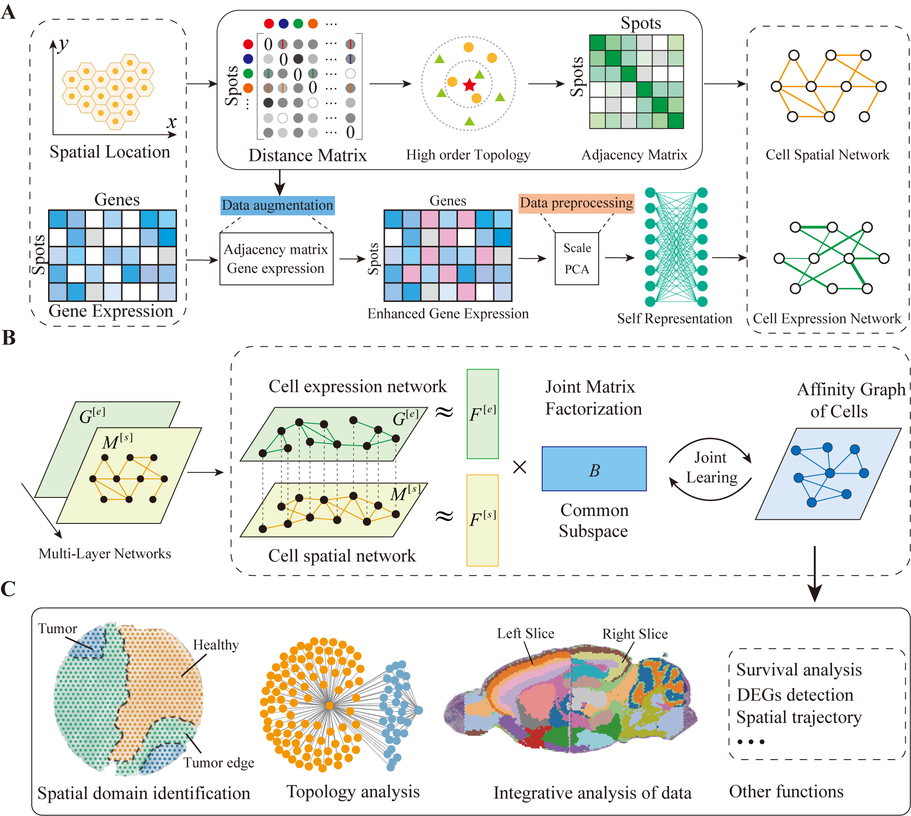

# MNMST v1.0

## Multi-Layer Network Model leverages identification of spatial domains from spatial transcriptomics data

###  Yu Wang, Zaiyi Liu, Xiaoke Ma

MNMST is a multi-layer network model to characterize and identify spatial domains in spatial transcriptomics data by integrating gene expression and spatial location information of cells. MNMST jointly decomposes multi-layer networks to learn discriminative features of cells, and identifies spatial domains by exploiting topological structure of affinity graph of cells. The proposed multi-layer network model not only outperforms state-of-the-art baselines on benchmarking datasets, but also precisely dissect cancer-related spatial domains. Furthermore, we also find that structure of spatial domains can be precisely characterized with topology of affinity graph of cells, proving the superiority of network-based models for spatial transcriptomics data. Moreover, MNMST provides an effective and efficient strategy for integrative analysis of spatial transcriptomic data, and also is applicable for processing spatial omics data of various platforms. In all, MNMST is a desirable tool for analyzing spatial transcriptomics data to facilitate the understanding of complex tissues.



## Tutorial

A jupyter Notebook of the tutorial is accessible from : 
<br>
https://github.com/xkmaxidian/MNMST/blob/main/tutorials_mnmst.ipynb

<br>

Please install **jupyter notebook** in order to open this notebook.

### Details: 

1. MNMST first employs SCANPY package to load and proprecess spatial transcriptomcis data:

```python
# load DLPFC 151675
section_id = '151675'
adata = sc.read_visium(path='Data/151675', count_file=section_id + '_filtered_feature_bc_matrix.h5')
adata.var_names_make_unique()
# filter genes
sc.pp.filter_genes(adata, min_cells=10)
sc.pp.highly_variable_genes(adata, flavor='seurat_v3', n_top_genes=3000)
hvg_filter = adata.var['highly_variable']
sc.pp.normalize_total(adata, inplace=True)
adata_all_genes = adata.copy()
adata = adata[:, hvg_filter]
# construct 1st-order cell spatial network
num_neighbours = 6
nbrs = NearestNeighbors(algorithm='ball_tree').fit(adata.obsm['spatial'])
weights_graph, distance_graph = generate_spatial_weights_fixed_nbrs(adata.obsm['spatial'], num_neighbours=num_neighbours, decay_type='reciprocal', nbr_object=nbrs, verbose=False)
# enhance data
nbrhood_contribution = 0.2
neighbour_agg_matrix = weights_graph @ adata.X
if sparse.issparse(adata.X):
    concatenated = sparse.hstack((adata.X, neighbour_agg_matrix), )
else:
    concatenated = np.concatenate((adata.X, neighbour_agg_matrix), axis=1,)

matrix = weighted_concatenate(zscore(adata.X, axis=0), zscore(neighbour_agg_matrix, axis=0), nbrhood_contribution)

if sparse.issparse(matrix):
    st_dev_pergene = matrix.toarray().std(axis=0)
else:
    st_dev_pergene = matrix.std(axis=0)

enhanced_data = matrix_to_adata(matrix, adata)

# PCA
sc.pp.pca(enhanced_data, n_comps=100)
low_dim_x = enhanced_data.obsm['X_pca']
```

2. Next, output enhanced expression and constructed Cell Spatial Network $W^{[s]}$：

```python
pd.DataFrame(low_dim_x).to_csv('data_for_matlab/' + section_id + '_exp_data.csv')
pd.DataFrame(weights_graph).to_csv('data_for_matlab/' + section_id + '_adj.csv')
```

3. Load proprecessed  gene expression and $W^{[s]}$ use MATLAB:

```matlab
% load proprecessed gene expression data
X = csvread('data_for_matlab/151675_arg_data.csv', 1, 1)';
% load cell spatial network
weights_adj = csvread('data_for_matlab/151675_adj.csv', 1, 1);
% load ground truth label
real_label = csvread('data_for_matlab/151675_real_label.csv', 1, 1);
real_label = real_label + 1;
% calculate domain number
cls_num = max(unique(real_label));
```

4. Construct Cell Expression Network $W^{[e]}$ by using input expression data:

```matlab
% We first construct nearset neighbor graph, which is employed to initialize self-representation learning and trace optimization optimization.
options = [];
option.Metric = 'Cosine';
options.NeighborMode = 'KNN';
options.k = 6;
options.WeightMode = 'Cosine';
cos_init = constructW(X',options);
clear options;

% Start sparse self representation here
cell_expression_network = self_rep(cos_init, X, 100, 10);
% After cell expression network constructed, we start joint NMF and affinity graph learning, where Z is the learned affinity graph:
[Z, B, F1, F2] = MNMST(best_graph, weights_adj, 10, 150, 0.01);
% finally, output the Z:
writematrix(Z, 'matlab_rs/learned_151675.csv')
```

5. MNMST identify spatial domains by using Leiden algorithm based on the learned affinity graph:

```python
import igraph as ig
import leidenalg
from natsort import natsorted

learned_graph_from_matlab = pd.read_csv('matlab_rs/learned_151675.csv', header=None)
learned_graph_from_matlab = learned_graph_from_matlab.to_numpy()

sources, targets = learned_graph_from_matlab.nonzero()
ans_weight = learned_graph_from_matlab[sources, targets]
g = ig.Graph(directed=True)
g.add_vertices(learned_graph_from_matlab.shape[0])
g.add_edges(list(zip(sources, targets)))
g.es['weight'] = ans_weight

partition_type = leidenalg.RBConfigurationVertexPartition
partition_kwargs = {'weights': np.array(g.es['weight']).astype(np.float64), 'n_iterations': -1, 'seed': 42,
                    'resolution_parameter': 1.3}

part = leidenalg.find_partition(g, partition_type, **partition_kwargs)
groups = np.array(part.membership)
leiden_label = pd.Categorical(
    values=groups.astype('U'),
    categories=natsorted(map(str, np.unique(groups))),
)
print(leiden_label)
enhanced_data.obs['mnmst_pred'] = leiden_label
enhanced_data.obs["mnmst_pred"] = enhanced_data.obs["mnmst_pred"].astype('int')
enhanced_data.obs['mnmst_pred'] = enhanced_data.obs['mnmst_pred'].astype('category')
```

6. Visualize the spatial domain identification results and output the ARI：

```python
refined_pred = refine(sample_id=enhanced_data.obs.index.tolist(), pred=enhanced_data.obs["mnmst_pred"].tolist(), dis=weights_graph.A, shape="hexagon")
enhanced_data.obs["refined_pred"] = refined_pred
enhanced_data.obs["refined_pred"] = enhanced_data.obs["refined_pred"].astype('category')
obs_df = enhanced_data.obs.dropna()
raw_ari = adjusted_rand_score(obs_df['Ground Truth'], obs_df['mnmst_pred'])
refine_ari = adjusted_rand_score(obs_df['Ground Truth'], obs_df['refined_pred'])

sc.pl.spatial(enhanced_data, color=['mnmst_pred', 'refined_pred', 'Ground Truth'], title=['MNMST (ARI=%.2f)'% raw_ari, 'refine_MNMST (ARI=%.2f)'% refine_ari, 'Ground Truth'])
```


## System Requirements

Python support packages: scanpy, igraph, pandas, numpy, scipy, scanpy, anndata, sklearn, seaborn.


##### The coding here is a generalization of the algorithm given in the paper. MNMST is written in Python and MATLAB programming language. To use, please clone this repository and follow the instructions provided in the README.md.

## File Descriptions:

Data/151675: Sample DLPFC 151675 dataset.

MNMST.m - The main function of MNMST.

run_MNMST.m - A script with a real spatial transcriptomcs data to show how to run the code.

SPPMI.m - construct PMI based on input graph (if sparse, if not, use PMI.m).

softth.m - singular value thresholding operator, which is employed to ensure low-rank.

solve_l1l2.m - solve $\|\cdot\|_{1,2}$ in objective function.

self_rep.m - Sparse self representation algorithm, which is employed to construct cell expression network.

bestMap.m - permute labels of predict to match real labels as good as possible.

SpectralClustering.m - We perfer use SpectralClustering to verify the learned affinity graph, and output the graph which has the highest ARI value.

## Compared spatial domain identification algorithms

Algorithms that are compared include: 

* [SCANPY](https://github.com/scverse/scanpy-tutorials)
* [Giotto](https://github.com/drieslab/Giotto)
* [BayesSpace](https://github.com/edward130603/BayesSpace)
* [stLearn](https://github.com/BiomedicalMachineLearning/stLearn)
* [SpaGCN](https://github.com/jianhuupenn/SpaGCN)
* [SEDR](https://github.com/JinmiaoChenLab/SEDR/)
* [DeepST](https://github.com/JiangBioLab/DeepST)

### Contact:

Please send any questions or found bugs to Xiaoke Ma [xkma@xidian.edu.cn](mailto:xkma@xidian.edu.cn).
